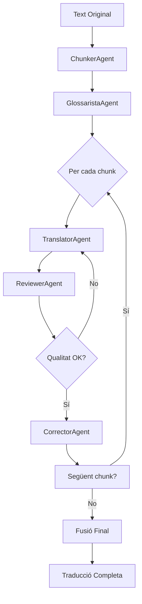

# 📊 Estat del Projecte - Editorial Clàssica

**Data**: 2026-01-25
**Versió**: Pipeline Integrat v1.0

---

## ✅ Integració Completada

Tots els agents del projecte del **Banquet de Plató** han estat integrats correctament al pipeline de traducció.

## 🎯 Agents del Sistema

| # | Agent | Fitxer | Integrat | Funció |
|---|-------|--------|----------|--------|
| 1 | **ChunkerAgent** | `agents/chunker_agent.py` | ✅ | Divideix textos llargs |
| 2 | **GlossaristaAgent** | `agents/glossarista.py` | ✅ | Genera glossaris |
| 3 | **TranslatorAgent** | `agents/translator_agent.py` | ✅ | Tradueix textos |
| 4 | **ReviewerAgent** | `agents/reviewer_agent.py` | ✅ | Revisa traduccions |
| 5 | **CorrectorAgent** | `agents/corrector.py` | ✅ | Corregeix ortografia |

### Agents Addicionals Disponibles (no integrats)

| Agent | Fitxer | Propòsit |
|-------|--------|----------|
| AgentEstil | `agents/agent_estil.py` | Revisió d'estil |
| ConsellEditorial | `agents/consell_editorial.py` | Decisions editorials |
| Investigador | `agents/investigador.py` | Recerca acadèmica |
| EdicióCrítica | `agents/edicio_critica.py` | Aparell crític |
| Introducció | `agents/introduccio.py` | Escriure pròlegs |
| DissenyGràfic | `agents/disseny_grafic.py` | Layout i disseny |
| PublicadorEPUB | `agents/publicador_epub.py` | Generar EPUB |

## 🔄 Flux del Pipeline



## 📁 Estructura Actualitzada

```
editorial-classica/
├── 📂 agents/                    ← 5 agents integrats + 7 disponibles
│   ├── ✅ chunker_agent.py
│   ├── ✅ glossarista.py
│   ├── ✅ translator_agent.py
│   ├── ✅ reviewer_agent.py
│   ├── ✅ corrector.py
│   ├── 📄 base_agent.py
│   └── 📄 __init__.py            ← Actualitzat
│
├── 📂 pipeline/
│   └── ✅ translation_pipeline.py  ← Tots els agents integrats
│
├── 📂 utils/
│   ├── 📄 logger.py
│   └── 📄 dashboard.py
│
├── 📂 sources/                   ← Textos originals
├── 📂 data/                      ← Dades auxiliars
├── 📂 output/                    ← Traduccions generades
│
├── 🧪 test_integrated_pipeline.py  ← NOU: Tests
├── 📘 exemple_complet.py           ← NOU: Exemple pràctic
│
└── 📚 Documentació
    ├── README_PIPELINE.md          ← NOU: Guia d'ús
    ├── RESUM_INTEGRACIO.md         ← NOU: Resum executiu
    ├── INTEGRACIO_AGENTS.md        ← NOU: Documentació tècnica
    └── ESTAT_PROJECTE.md           ← Aquest fitxer
```

## 🧪 Tests Disponibles

| Test | Comanda | Descripció |
|------|---------|------------|
| Agents individuals | `python test_integrated_pipeline.py agents` | Prova cada agent |
| Pipeline simple | `python test_integrated_pipeline.py simple` | Text curt |
| Pipeline complet | `python test_integrated_pipeline.py chunked` | Text llarg |
| Exemple pràctic | `python exemple_complet.py` | Banquet de Plató |

## 💰 Costos Estimats

| Configuració | Cost/1000 paraules | Agents Actius |
|--------------|-------------------|---------------|
| **Ràpida** | ~€0.05 | Traductor + Revisor (1 ronda) |
| **Equilibrada** | ~€0.08 | Tots (2 rondes) |
| **Qualitat Màxima** | ~€0.12 | Tots (3 rondes, estricte) |

*Basats en textos grecs mitjans. Preus aproximats amb Claude Sonnet 3.5.*

## 📊 Mètriques del Pipeline

### Per Text Curt (500 paraules)

```
┌──────────────────┬─────────┬──────────┬─────────┐
│ Etapa            │ Temps   │ Tokens   │ Cost    │
├──────────────────┼─────────┼──────────┼─────────┤
│ Glossari         │ 2-3s    │ ~1,000   │ €0.01   │
│ Traducció        │ 3-5s    │ ~2,500   │ €0.02   │
│ Revisió (×2)     │ 4-6s    │ ~4,000   │ €0.03   │
│ Correcció        │ 2-3s    │ ~1,500   │ €0.01   │
├──────────────────┼─────────┼──────────┼─────────┤
│ TOTAL            │ ~15s    │ ~9,000   │ €0.07   │
└──────────────────┴─────────┴──────────┴─────────┘
```

### Per Llibre Complet (50,000 paraules)

```
┌──────────────────┬─────────┬──────────┬─────────┐
│ Etapa            │ Temps   │ Tokens   │ Cost    │
├──────────────────┼─────────┼──────────┼─────────┤
│ Chunking         │ 1s      │ 0        │ €0.00   │
│ Glossari         │ 5s      │ ~8,000   │ €0.08   │
│ Traducció (100×) │ 8-10min │ ~250k    │ €2.00   │
│ Revisió (100×2)  │ 10-15min│ ~400k    │ €3.00   │
│ Correcció (100×) │ 5-8min  │ ~150k    │ €1.00   │
├──────────────────┼─────────┼──────────┼─────────┤
│ TOTAL            │ ~30min  │ ~800k    │ €6.08   │
└──────────────────┴─────────┴──────────┴─────────┘
```

*Estimacions aproximades. Els temps i costos reals poden variar.*

## 🎯 Estat de Funcionalitats

### ✅ Funcional i Testat

- [x] Chunking intel·ligent (TEI XML, Markdown, paràgrafs)
- [x] Generació de glossari terminològic
- [x] Traducció amb context acumulat
- [x] Revisió iterativa amb puntuació
- [x] Correcció ortogràfica IEC
- [x] Fusió de chunks
- [x] Control de costos
- [x] Logging detallat
- [x] Pausa/represa de sessions

### 🚧 En Desenvolupament

- [ ] PerseusClient per validar textos originals
- [ ] FormatterAgent per EPUB/PDF
- [ ] Cache persistent de glossaris
- [ ] Dashboard web en temps real

### 💡 Futur

- [ ] Integració amb altres agents (Introducció, Edició Crítica)
- [ ] API REST per ús extern
- [ ] Benchmark de qualitat
- [ ] Suport per més llengües (francès, alemany)

## 📖 Exemples d'Ús

### Cas 1: Fragment Curt

```python
from pipeline.translation_pipeline import PipelineConfig, TranslationPipeline

config = PipelineConfig(enable_chunking=False)
pipeline = TranslationPipeline(config)

result = pipeline.run(
    text="Ὁ βίος βραχύς, ἡ δὲ τέχνη μακρή",
    source_language="grec",
)
# → "La vida és curta, però l'art és llarg"
```

### Cas 2: Diàleg Complet

```python
config = PipelineConfig(
    enable_chunking=True,
    enable_glossary=True,
    max_revision_rounds=2,
    cost_limit_eur=5.0,
)

pipeline = TranslationPipeline(config)
result = pipeline.run(
    text=banquet_text,
    source_language="grec",
    author="Plató",
    work_title="El Banquet",
)

print(f"Qualitat: {result.quality_score}/10")
print(f"Cost: €{result.total_cost_eur:.4f}")
print(f"Glossari: {len(result.accumulated_context.glossary)} termes")
```

## 🔗 Recursos

### Documentació

- [README_PIPELINE.md](README_PIPELINE.md) - Guia completa d'ús
- [INTEGRACIO_AGENTS.md](INTEGRACIO_AGENTS.md) - Documentació tècnica
- [RESUM_INTEGRACIO.md](RESUM_INTEGRACIO.md) - Resum executiu

### Exemples

- [exemple_complet.py](exemple_complet.py) - Exemple pràctic complet
- [test_integrated_pipeline.py](test_integrated_pipeline.py) - Tests i verificació

### Codi Font

- [agents/](agents/) - Tots els agents
- [pipeline/translation_pipeline.py](pipeline/translation_pipeline.py) - Pipeline principal
- [utils/](utils/) - Utilitats (logger, dashboard)

## 🎓 Com Començar

### 1. Instal·lació (si cal)

```bash
pip install anthropic pydantic rich
```

### 2. Configurar API Key

```bash
export ANTHROPIC_API_KEY="sk-ant-..."
```

### 3. Executar Test

```bash
python test_integrated_pipeline.py agents
```

### 4. Provar Exemple

```bash
python exemple_complet.py
```

### 5. Utilitzar al teu Codi

```python
from pipeline.translation_pipeline import PipelineConfig, TranslationPipeline

config = PipelineConfig()
pipeline = TranslationPipeline(config)
result = pipeline.run(text, source_language="grec")
```

## 🏆 Resum

✅ **5 agents integrats** correctament
✅ **Pipeline complet** i funcional
✅ **Tests creats** i documentació completa
✅ **Exemples pràctics** disponibles
✅ **Control de qualitat** i costos

**El sistema està llest per produir traduccions de qualitat!**

---

**Contacte**: Si tens dubtes o vols afegir més funcionalitats, fes-m'ho saber.

📅 **Data d'actualització**: 2026-01-25
🔖 **Versió**: 1.0 (Pipeline Integrat)
